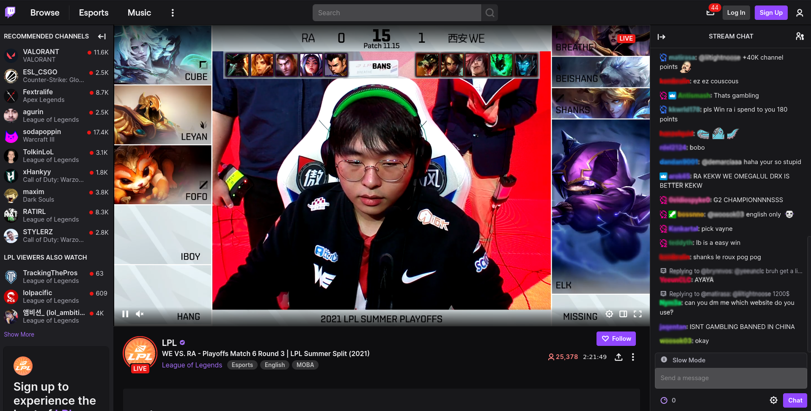
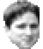
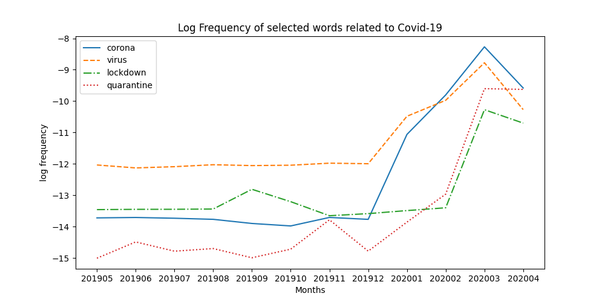
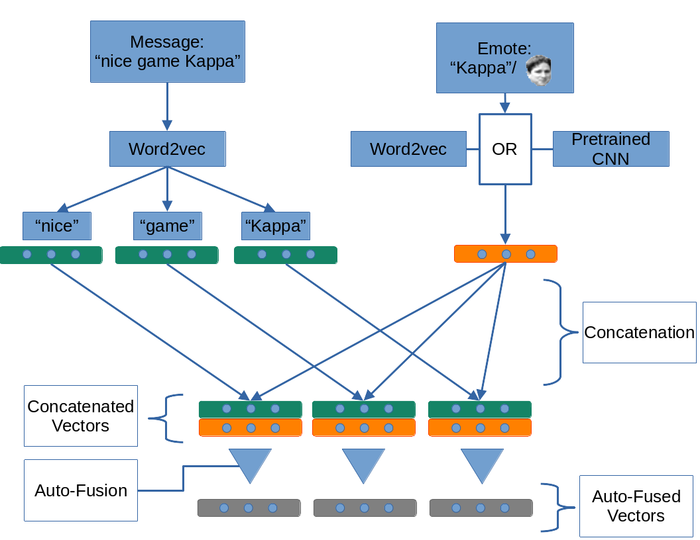

# Structure

> 1. Background
2. Traditional Methods
3. Selected Experiments and Results
4. Multimodal Semantic Change Detection
5. Conclusion

# 1. Background {style="text-align:center"}

# Twitch.tv Recap

>- Livestreaming platform
- Mainly focussed on gaming content
- Live Chat: Viewers can interact in real time with streamers and other users

# 

# Twitch Chat

## {.left}

>- Short messages (median: 3 tokens)
- Memes and inside jokes
- High amount of Emotes

## Emotes{.fragment .left}

>- Unique to Twitch
- Twitch translates text representation to image
- Example: "*Kappa*" $\Rightarrow$ 
- Carry meaning (e.g. "*Kappa*" $=$ Sarcasm)

# Semantic Change

## {.left}
Changes to or differences in the meaning and/or usage of words over time or between different domains 

## {.fragment}

![[@kulkarni2015statistically]](img/gay.png)

#

## Diachronic Semantic Change

Words changing meaning over time.

## Synchronic Semantic Change

Domain-specific semantic change: Words having different meanings in different domains.

# Master Thesis Motivation

>- Is it possible to detect semantic change in Twitch chat messages?
- How quickly does the meaning of words, memes, and Emotes change on Twitch?
- Do Emotes have special impact on the semantic change happening on Twitch?

# Data

>- May 2019 - April 2020
- 5.5 Billion messages
- 560 GB of data; 165 GB in plain text
- Average message length: 5.4 tokens; median: 3 tokens
- Minimal text preprocessing
- Messages either ungrouped (one message = one sentence for Word Embeddings) or in distinct blocks of 30s/60s (one block = one sentence for Word Embeddings)

# Synthetic Evaluation Framework

>- @shoemark2019room inject pseudowords with synthetically generated semantic change
- Synthetic dataset over custom time span with artificial semantic change
- Measure performance of semantic change detection systems based on how well pseudowords are detected

# 2. Traditional Methods {style="text-align:center"}

# Approach

>- **Word Embeddings**: Word2vec (Skip-Gram and CBOW)
- **Alignment**: Embedding matrices aligned after training using *orthogonal procrustes* to ensure comparability [@hamilton2016diachronic]
- **Distance**: Measure distance between vectors of a word using cosine distance or a *neighborhood* measure comparing the nearest neighbors

# {.notes}

- The orthogonal Procrustes problem is a matrix approximation problem in linear algebra. In its classical form, one is given two matrices A and B and asked to find an orthogonal matrix $\Omega$ which most closely maps A to $\displaystyle B$.
- Neighborhood: second-order vector using neighbors of a word. Comparing constructed vectors to see whether the neighborhood has changed

#

>- **Two-Step approach**: Measuring distance of word vectors between two time steps or domains
- **Change-point approach**: Detecting a change-point in the meaning trajectory of a word in a time series
- **Output**: A list of semantic change candidates ranked by distance (descending)

# {.notes}

- comparison/alignment model first or last
- calculate distance in reference to this comparison model
- time-series of distances
- change-point: mean-shift score for each word for time-series

# 3. Example Experiments and Results {style="text-align:center"}

# Example 1: Change Points for Selected Words

# {.notes}

- log scale because of wide range of values

# Example 1: Detected Change Points {.left}

- **corona**: December 2019
- **virus**: December 2019
- **lockdown**: February 2020
- **quarantine**: February 2020

(In the majority out of 8 tested configurations)

# Example 2: Synchronic Semantic Change Detection between Games

## League of Legends vs Dota 2

- (Relatively) similar games
- Based on same Warcraft 3 custom game
- Common domain-specific vocabulary (e.g. *farming*)

# Example 2: Experiment

>- Extract messages of each game from entire Twitch data set
- Train word embeddings separately
- 4 configurations (CBOW/Skip-gram $\times$ cosine/neighborhood)
- 50 non-duplicate words out of 80 (top 20 for each configuration)
- Domain experts: 14 words with attested semantic change, 21 with specific context but no explainable semantic change, 15 "normal" words

# Example 2: Selected Results

## Words with specific context in both games

| Term        | Explanation                                                                                               |
|-------------|-----------------------------------------------------------------------------------------------------------|
| blitz/Blitz | LoL champion *Blitzcrank* vs Dota 2 personality William "Blitz" Lee                                       |
| RP          | Dota 2: abbreviation for ability *Reverse Polarity*; LoL: ingame currency formerly known as *Riot Points* |
| s4          | Dota 2: Pro player Gustav "s4" Magnusson; LoL: Either *Season 4* ($\widehat{=}$ 2014) or *Silver IV* (ingame rank)             |

# Example 2: Selected Results

## Words with specific context in one of the games

| Term     | Explanation                                   |
|----------|-----------------------------------------------|
| grant    | Dota 2 personality *GranDGranT* vs *to grant* |
| jinx     | LoL champion *Jinx* vs *to jinx*              |
| infamous | Peruvian Dota 2 team                          |

# Other Experiments

>- Reproduction of results reported by @schlechtweg2019woc
- Change-point analysis of german texts (Deutsches Textarchiv, DTA); Comparison to results of *Jena Semantic Explorer* ([http://jeseme.org/](http://jeseme.org/))
- Successfully applied synthetic evaluation framework [@shoemark2019room] to Twitch data and DTA data
- Successfully applied change-point approach to Dota 2 chat messages (Detected change-points correlating with events e.g. creation of new esports team)

# 4. Multimodal Semantic Change Detection

# Why multimodal?

>- Twitch chat messages not only text
- Emotes not only tokens in text
- Emotes are sentence modifiers (see: *Kappa* $\widehat{=}$ Sarcasm)
- Train word and emote representations separately
- Fuse vectors using *Auto-Fusion* architecture by @sahu2019adaptive

# Architecture 

## {style="text-align:center"}

{width=70%}

# Multimodal Discussion

- Evaluation using synthetic evaluation framework
- Results not competitive compared to using traditional approach

## Possible reasons: {.fragment}

>- Too much information gets lost in preliminary steps (emote embeddings, concatenation)
- Auto-Fusion module does not learn how to combine the information
- Not very much additional information is provided by treating emotes as sentence modifiers
- The additional information by treating emotes as sentence modifiers has no impact on semantic change detection

# 5. Conclusion

>- Successfully reproduced existing results
- Successfully applied existing methods to a novel dataset
- Developed an experimental method for multimodal semantic change detection

# Thank You! {style="text-align:center"}

# Bibliography